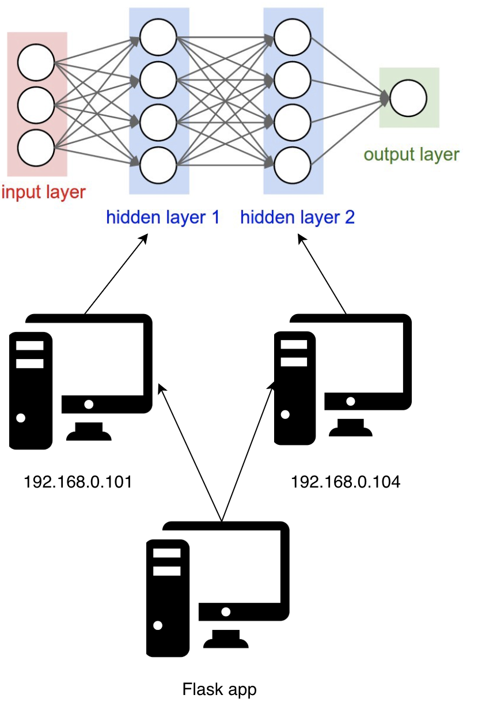

## What is exactly this folder about?

Basically we split our feed-forward process to different machines.

First machine may only done first layer, second machine may only done second layer and etc.

We load our model checkpoint and wrap it with Flask.



## How-to

Assume I have two machines, first `192.168.0.101`, second `192.168.0.104`.

1. Copy `backend.py` to both machines and run it.

First machine,
```bash
python3 backend.py 0
```
```text
2018-11-05 21:30:24.948465: I tensorflow/core/platform/cpu_feature_guard.cc:141] Your CPU supports instructions that this TensorFlow binary was not compiled to use: AVX2 FMA
2018-11-05 21:30:24.950125: I tensorflow/core/distributed_runtime/rpc/grpc_channel.cc:222] Initialize GrpcChannelCache for job worker -> {0 -> localhost:2222, 1 -> 192.168.0.104:2223}
2018-11-05 21:30:24.950590: I tensorflow/core/distributed_runtime/rpc/grpc_server_lib.cc:381] Started server with target: grpc://localhost:2222
```

Second machine,
```bash
python3 backend.py 1
```
```text
2018-11-05 21:30:35.549035: I tensorflow/core/platform/cpu_feature_guard.cc:141] Your CPU supports instructions that this TensorFlow binary was not compiled to use: AVX2 FMA
2018-11-05 21:30:35.550251: I tensorflow/core/distributed_runtime/rpc/grpc_channel.cc:222] Initialize GrpcChannelCache for job worker -> {0 -> 192.168.0.101:2222, 1 -> localhost:2223}
2018-11-05 21:30:35.550586: I tensorflow/core/distributed_runtime/rpc/grpc_server_lib.cc:381] Started server with target: grpc://localhost:2223
```

2. Run `reduce-mean.py` to make sure everything is okay, can skip this step,
```bash
python3 reduce-mean.py
```
```text
0.5361499
```

We can see that on our first machine terminal,
```text
Start master session e91a8d5d551a9e94 with config: gpu_options { allow_growth: true } graph_options { place_pruned_graph: true }
```

3. Run our monkey,
```bash
bash monkey.sh 2
```

`2` represents TWO different feed-forwards distributed among machines to support more concurrent users.

4. curl to test,
```bash
curl http://localhost:8008/?text=piece%20of%20shit
```
```text
negative
```
