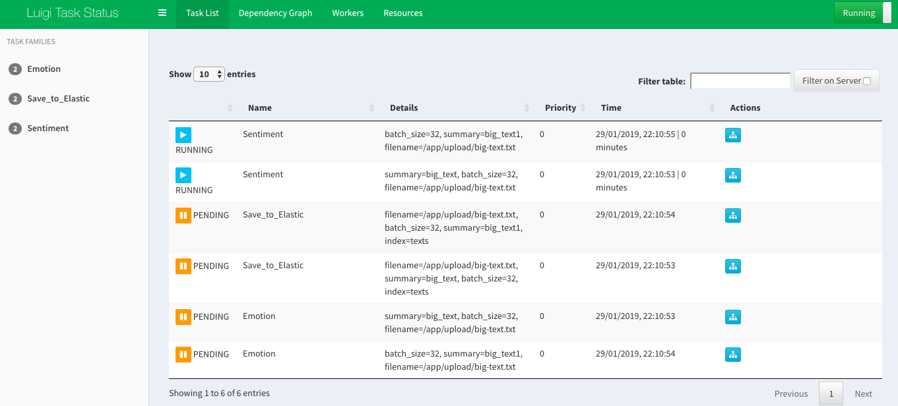

## How-to

1. Make sure you installed `Docker` and `Docker-compose`.

2. Spawn the container,
```bash
docker-compose -f docker-compose.yml up --build
```

3. Request to put inside queue,
```bash
curl --form file=@big-text.txt --form topic=big_text localhost:5000/upload
curl --form file=@big-text.txt --form topic=big_text localhost:5000/upload
```

4. Query inside kibana,

```
GET /_cat/indices?v

GET long_text/_search
```


## Screenshot

#### Flower dashboard


#### Luigi dashboard


