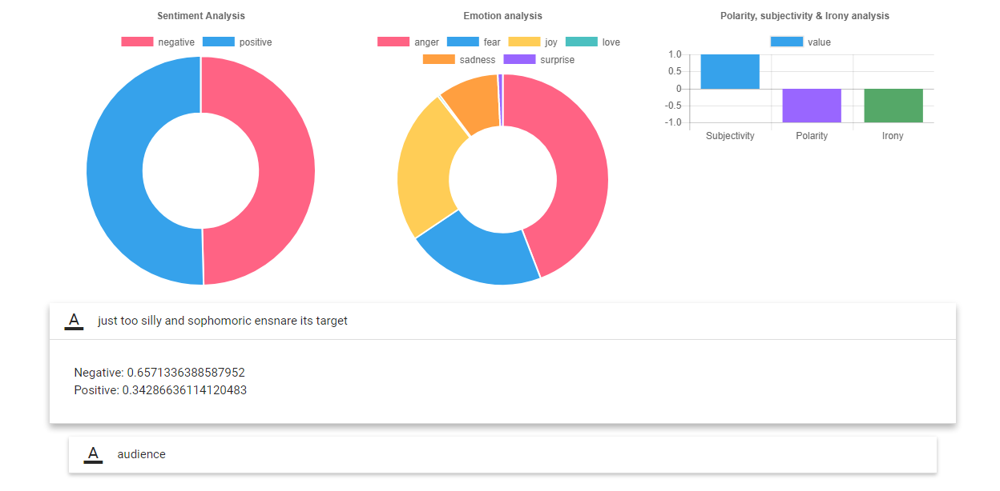

# Sentiment-Emotion-API-Tensorflow
Create your own emotion and sentiment API using Tensorflow Recurrent Neural Network

This repository will show you how to instantiate 2 different Tensorflow graphs in shared memory.

## You may download pretrained model for sentiment and emotion [here](https://drive.google.com/drive/folders/0BxQQlrLbdunWRFZNcEdnSGdZaGc?usp=sharing)

```text
|--- server.py
|    to bind our app into port
|
|--- train.py
|    to train your own data-set
|
|--- data
|    create new folder name 'data' and insert your own data-set here, [negative, positive]
|--- data/negative
|--- data/positive
```

make sure check setting.py first
```python
# these global variables for vectors model
dimension = 512
skip_size = 8
skip_window = 1
num_skips = 2
iteration_train_vectors = 20000

# these global variables for NN
num_layers = 3
size_layer = 256
learning_rate = 0.0001
epoch = 100
batch = 100
maxlen = 50
```

make sure change port or IP in server.py first
```python
if __name__ == '__main__':
    # 0.0.0.0 for public ip
    # define your port
    # thread = True if want multi-thread, depends on your OS
    app.run(host = '0.0.0.0', threaded = True,  port = 999999)
```

Remember, Flask cannot support a lot concurrent thread at the same time, maybe you can check [Gunicorn](http://gunicorn.org/#quickstart)

```bash
sudo pip install gunicorn
```

```bash
sudo gunicorn -w (NUMBER_OF_WORKER) -b (BINDING_ADDRESS:PORT) -p gunicorn.pid (FLASK_PYNAME):app
# sudo gunicorn -w 4 -b 0.0.0.0:8000 -p gunicorn.pid server:app
```
Make sure you have a lot of RAM to initialise multi-workers

I deployed this API in my live server, you can do GET request from here
```text
www.huseinhouse.com:8020/sentiment?text=
```

Or check [this website](http://www.huseinhouse.com/sentiment/) for simple application layer


