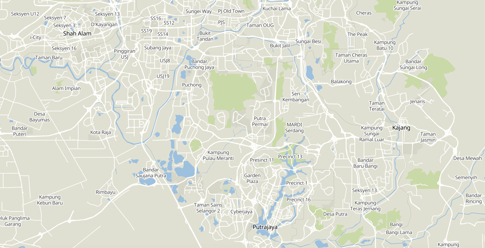

# Gather-Deployment

Gathers Python deployment, infrastructure and practices.

## Table of contents
  * [Requirements](#Requirements)
  * [Tensorflow deployment](#tensorflow-deployment)
  * [Simple Backend](#simple-backend)
  * [Apache stack](#apache-stack)
  * [simple data pipeline](#simple-data-pipeline)
  * [Realtime ETL](#realtime-etl)
  * [Unit test](#unit-test)
  * [Stress test](#stress-test)
  * [Monitoring](#monitoring)
  * [Mapping](#mapping)
  * [Miscellaneous](#Miscellaneous)
  * [Practice PySpark](#practice-pyspark)
  * [Practice PyFlink](#practice-pyflink)
  * [Printscreen](#printscreen)

## Requirements

1. Docker
2. Docker compose

## [Tensorflow deployment](tensorflow)

1. Object Detection. _Flask SocketIO + WebRTC_

Stream from webcam using WebRTC -> Flask SocketIO to detect objects -> WebRTC -> Website.

2. Object Detection. _Flask SocketIO + opencv_

Stream from OpenCV -> Flask SocketIO to detect objects -> OpenCV.

3. Speech streaming. _Flask SocketIO_

Stream speech from microphone -> Flask SocketIO to do realtime speech recognition.

4. Text classification. _Flask + Gunicorn_

Serve Tensorflow text model using Flask multiworker + Gunicorn.

5. Image classification. _TF Serving_

Serve image classification model using TF Serving.

6. Image Classification using Inception. _Flask SocketIO_

Stream image using SocketIO -> Flask SocketIO to classify.

7. Object Detection. _Flask + opencv_

Webcam -> Opencv -> Flask -> web dashboard.

8. Face-detection using MTCNN. _Flask SocketIO + opencv_

Stream from OpenCV -> Flask SocketIO to detect faces -> OpenCV.

9. Face-detection using MTCNN. _opencv_

Webcam -> Opencv.

10. Image classification using Inception. _Flask + Docker_

Serve Tensorflow image model using Flask multiworker + Gunicorn on Docker container.

11. Image classification using Inception. _Flask + EC2 Docker Swarm + Nginx load balancer_

Serve inception on multiple AWS EC2, scale using Docker Swarm, balancing using Nginx.

12. Text classification. _Hadoop streaming MapReduce_

Batch processing to classify texts using Tensorflow text model on Hadoop MapReduce.

13. Text classification. _Kafka_

Stream text to Kafka producer and classify using Kafka consumer.

14. Text classification. _Distributed TF using Flask + Gunicorn + Eventlet_

Serve text model on multiple machines using Distributed TF + Flask + Gunicorn + Eventlet. Means that, Distributed TF will split a single neural network model to multiple machines to do feed-forward.

15. Text classification. _Tornado + Gunicorn_

Serve Tensorflow text model using Tornado + Gunicorn.

16. Text classification. _Flask + Celery + Hadoop_

Submit large texts using Flask, signal queue celery job to process using Hadoop, delay Hadoop MapReduce.

17. Text classification. _Luigi scheduler + Hadoop_

Submit large texts on Luigi scheduler, run Hadoop inside Luigi, event based Hadoop MapReduce.

18. Text classification. _Luigi scheduler + Distributed Celery_

Submit large texts on Luigi scheduler, run Hadoop inside Luigi, delay processing.

19. Text classification. _Airflow scheduler + elasticsearch + Flask_

Scheduling based processing using Airflow, store inside elasticsearch, serve it using Flask.

20. Text classification. _Apache Kafka + Apache Storm_

Stream from twitter -> Kafka Producer -> Apache Storm, to do distributed minibatch realtime processing.

21. Text classification. _Dask_

Batch processing to classify texts using Tensorflow text model on Dask.

22. Text classification. _Pyspark_

Batch processing to classify texts using Tensorflow text model on Pyspark.

23. Text classification. _Pyspark streaming + Kafka_

Stream texts to Kafka Producer -> Pyspark Streaming, to do minibatch realtime processing.

24. Text classification. _Streamz + Dask + Kafka_

Stream texts to Kafka Producer -> Streamz -> Dask, to do minibatch realtime processing.

25. Text classification. _FastAPI + Streamz + Water Healer_

Change concurrent requests into mini-batch realtime processing to speed up text classification.

26. Text classification. _PyFlink_

Batch processing to classify texts using Tensorflow text model on Flink batch processing.

27. Text classification. _PyFlink + Kafka_

Stream texts to Kafka Producer -> PyFlink Streaming, to do minibatch realtime processing.

28. Object Detection. _ImageZMQ_

Stream from N camera clients using ImageZMQ -> N slaves ImageZMQ processing -> single dashboard.

## [Simple Backend](simple-backend)

1. Flask
2. Flask with MongoDB
3. REST API Flask
4. Flask Redis PubSub
5. Flask Mysql with REST API
6. Flask Postgres with REST API
7. Flask Elasticsearch
8. Flask Logstash with Gunicorn
9. Flask SocketIO with Redis
10. Multiple Flask with Nginx Loadbalancer
11. Multiple Flask SocketIO with Nginx Loadbalancer
12. RabbitMQ and multiple Celery with Flask
13. Flask + Gunicorn + HAproxy

## [Apache stack](apache-stack)

1. Flask with Hadoop Map Reduce
2. Flask with Kafka
3. Flask with Hadoop Hive
4. PySpark with Jupyter
5. Apache Flink with Jupyter
6. Apache Storm with Redis
7. Apache Flink with Zeppelin and Kafka
8. Kafka cluster + Kafka REST
9. Spotify Luigi + Hadoop streaming

## [simple data pipeline](pipeline)

1. Streaming Tweepy to Elasticsearch
2. Scheduled crawler using Luigi Spotify to Elasticsearch
3. Airflow to Elasticsearch

## [Realtime ETL](#realtime-etl)

1. MySQL -> Apache NiFi -> Apache Hive
2. PostgreSQL CDC -> Debezium -> KsqlDB

## [Unit test](unit-test)

1. Pytest

## [Stress test](stresstest)

1. Locust

## [Monitoring](monitoring)

1. PostgreSQL + Prometheus + Grafana
2. FastAPI + Prometheus + Loki + Jaeger

## [Mapping](mapping)

**Focused for Malaysia, for other countries, you need to change download links**.

1. OSRM Malaysia
2. Maptiler Malaysia
3. OSM Style Malaysia

## [Miscellaneous](misc)

1. Elasticsearch + Kibana + Cerebro
2. Jupyter notebook
3. Jupyterhub
4. Jupyterhub + Github Auth
5. AutoPEP8
6. Graph function dependencies
7. MLFlow

## [Practice PySpark](practice-pyspark)

1. Simple PySpark SQL.

- Simple PySpark SQL.

2. Simple download dataframe from HDFS. 

- Create PySpark DataFrame from HDFS.

3. Simple PySpark SQL with Hive Metastore.

- Use PySpark SQL with Hive Metastore.

4. Simple Delta lake.

- Simple Delta lake.

5. Delete Update Upsert using Delta.

- Simple Delete Update Upsert using Delta lake.

6. Structured streaming using Delta.

- Simple structured streaming with Upsert using Delta streaming.

7. Kafka Structured streaming using Delta.

- Kafka structured streaming from PostgreSQL CDC using Debezium and Upsert using Delta streaming.

8. PySpark ML text classification.

- Text classification using Logistic regression and multinomial in PySpark ML.

9. PySpark ML word vector.

- Word vector in PySpark ML.

## [Practice PyFlink](practice-pyflink)

1. Simple Word Count to HDFS.

- Simple Table API to do Word Count and sink into Parquet format in HDFS.

2. Simple Word Count to PostgreSQL.

- Simple Table API to do Word Count and sink into PostgreSQL using JDBC.

3. Simple Word Count to Kafka.

- Simple Table API to do Word Count and sink into Kafka.

4. Simple text classification to HDFS.

- Load trained text classification model using UDF to classify sentiment and sink into Parquet format in HDFS.

5. Simple text classification to PostgreSQL.

- Load trained text classification model using UDF to classify sentiment and sink into PostgreSQL.

6. Simple text classification to Kafka.

- Load trained text classification model using UDF to classify sentiment and sink into Kafka.

7. Simple real time text classification upsert to PostgreSQL.

- Simple real time text classification from Debezium CDC and upsert into PostgreSQL.

8. Simple real time text classification upsert to Kafka.

- Simple real time text classification from Debezium CDC and upsert into Kafka Upsert.

9. Simple Word Count to Apache Hudi.

- Simple Table API to do Word Count and sink into Apache Hudi in HDFS.

10. Simple text classification to Apache Hudi.

- Load trained text classification model using UDF to classify sentiment and sink into Apache Hudi in HDFS.

11. Simple real time text classification upsert to Apache Hudi.

- Simple real time text classification from Debezium CDC and upsert into Apache Hudi in HDFS.

## Printscreen

