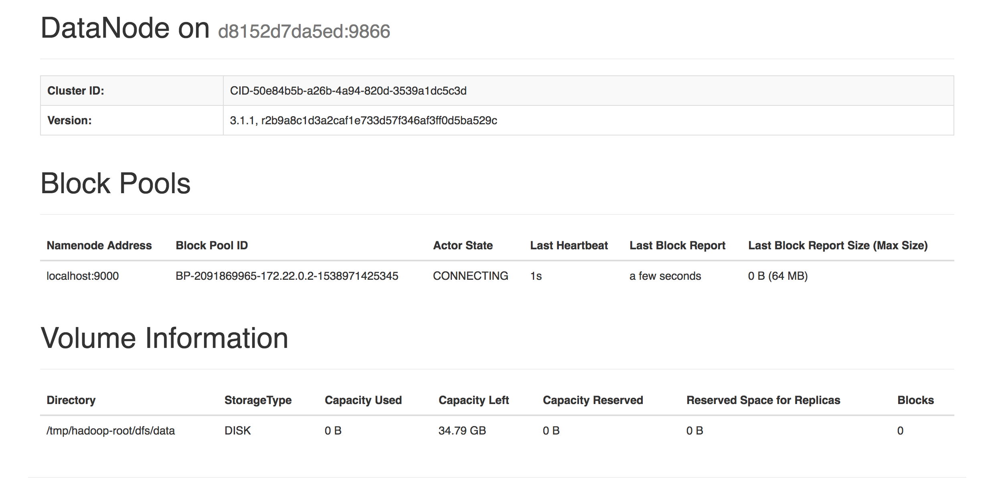
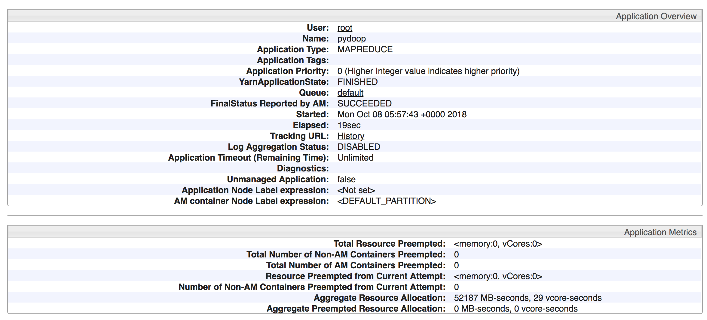

## How-to

1. Run `Docker compose`,
```bash
compose/build
```

2. Request the server,
```bash
curl --form file=@18.flask-hadoop/text.txt localhost:5000/lowercase
```
```text
["husein\nbin\nzolkepli\n"]
```




