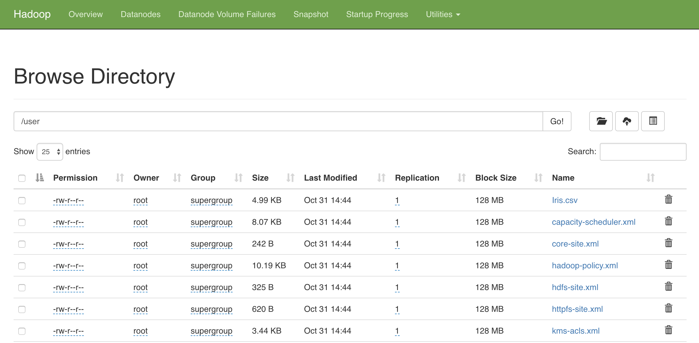

## How-to

1. Run `Docker compose`,
```bash
compose/build
```

2. Open jupyter notebook from link provided in terminal,
```text
pyspark_1  |     Copy/paste this URL into your browser when you connect for the first time,
pyspark_1  |     to login with a token:
pyspark_1  |         http://(4d8ed5c57e9f or 127.0.0.1):8080/?token=b7a118cfcc021d8f1bffa9ba94dd18337c13a12ce6ad6c6c
```

There are some notebook examples how to read CSV from HDFS.


