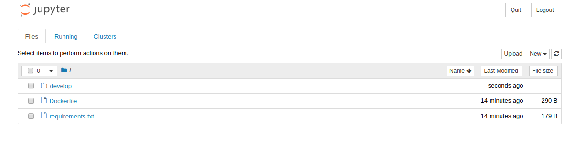

# Programming-Environment

you only need docker compose to start programming environment

## How-to Start
```bash
sudo develop/up
```

First time it will slow, afterwards, it will fast, caching already.

Found an output,
```string
...:8080/?token=...
```
copy the entire line from :8080 until the end and paste into your browser. Happy coding inside the jupyter :)

## How-to Bash
```bash
# open new terminal, run this while another terminal is running develop/up
sudo develop/shell
```


