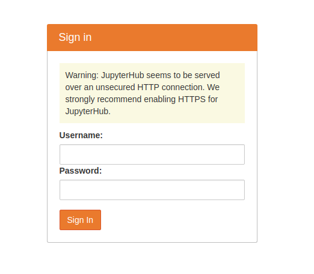

# Jupyterhub

docker compose jupyterhub

## How-to Start
```bash
sudo develop/up
```

First time it will slow, afterwards, it will fast, caching already.

Open localhost:8000. Insert, jupyter for username, jupyter123 for password, and Happy coding inside the jupyterhub :)

## How-to Bash
```bash
# open new terminal, run this while another terminal is running develop/up
sudo develop/shell
```


