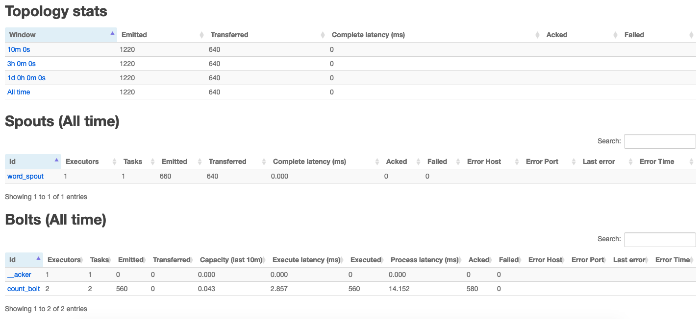
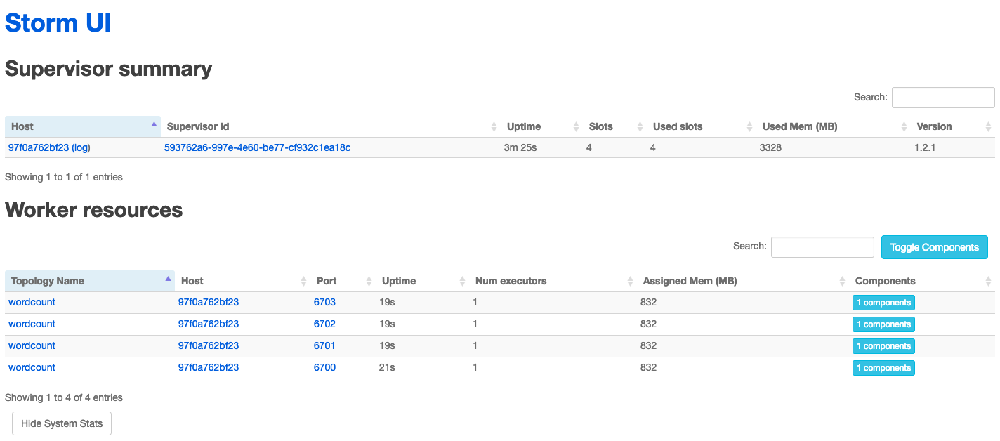
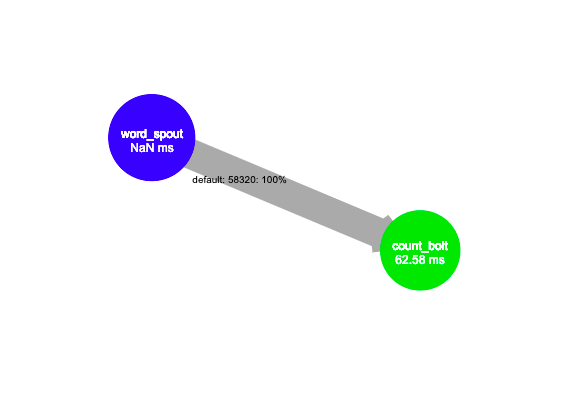

# Apache storm

docker compose storm cluster

## How-to Start
Prune docker image first,
```bash
docker image prune -f
docker container prune -f
```

```bash
docker-compose up --build --force-recreate
```

Nimbus is pretty slow to run up, if you get output like this,
```text
streamparse    | thriftpy.transport.TTransportException: TTransportException(type=1, message="Could not connect to ('nimbus', 6627)")
```

So you need to wait Nimbus to spawn,
```text
Running: java -server -Ddaemon.name=nimbus -Dstorm.options= -Dstorm.home=/apache-storm-1.2.1 -Dstorm.log.dir=/logs -Djava.library.path=/usr/local/lib:/opt/local/lib:/usr/lib -Dstorm.conf.file= -cp /apache-storm-1.2.1/*:/apache-storm-1.2.1/lib/*:/apache-storm-1.2.1/extlib/*:/apache-storm-1.2.1/extlib-daemon/*:/conf -Xmx1024m -Djava.net.preferIPv4Stack=true -Dlogfile.name=nimbus.log -DLog4jContextSelector=org.apache.logging.log4j.core.async.AsyncLoggerContextSelector -Dlog4j.configurationFile=/apache-storm-1.2.1/log4j2/cluster.xml org.apache.storm.daemon.nimbus
```

## Storm UI

Visit [localhost:8085](http://localhost:8085) for storm UI






