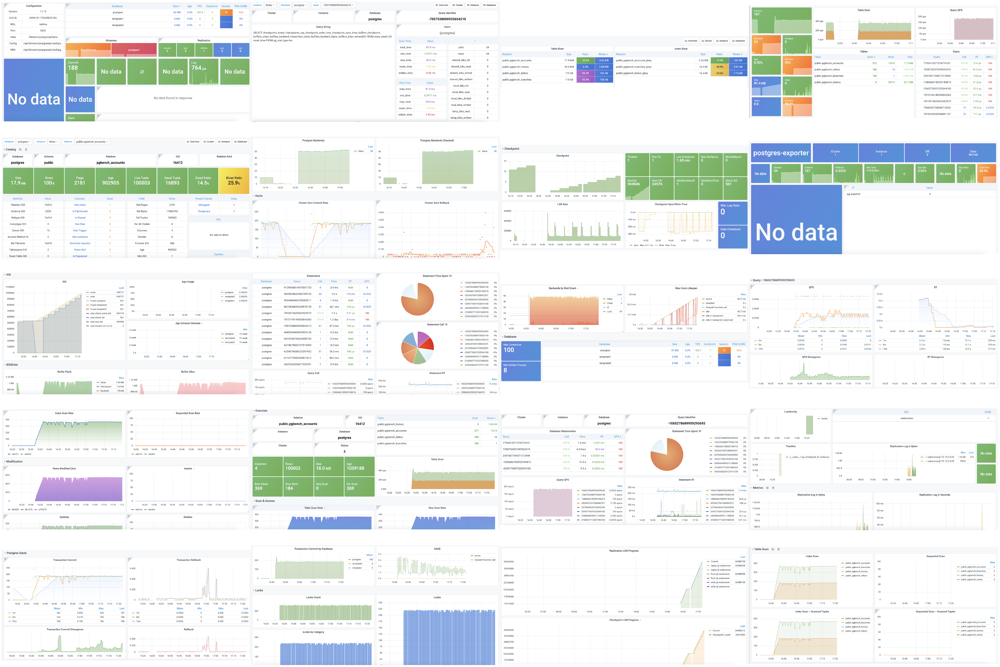

## How-to

Thanks to https://github.com/Vonng/pg_exporter for PostgreSQL Exporter and https://github.com/Vonng/pigsty for Grafana templates, I just merely edit to suit my requirements.

1. Run Postgres with Replica,

```bash
docker-compose -f postgres.yaml up --build -d
```

2. Install necessary extensions and functions,

```bash
PGPASSWORD=postgres psql -U postgres -c \
"""
DROP SCHEMA IF EXISTS monitor;
CREATE SCHEMA monitor;
CREATE extension pg_stat_statements WITH SCHEMA monitor;

CREATE OR REPLACE VIEW monitor.pg_table_bloat AS
    SELECT CURRENT_CATALOG AS datname, nspname, relname , bs * tblpages AS size,
           CASE WHEN tblpages - est_tblpages_ff > 0 THEN (tblpages - est_tblpages_ff)/tblpages::FLOAT ELSE 0 END AS ratio
    FROM (
             SELECT ceil( reltuples / ( (bs-page_hdr)*fillfactor/(tpl_size*100) ) ) + ceil( toasttuples / 4 ) AS est_tblpages_ff,
                    tblpages, fillfactor, bs, tblid, nspname, relname, is_na
             FROM (
                      SELECT
                          ( 4 + tpl_hdr_size + tpl_data_size + (2 * ma)
                              - CASE WHEN tpl_hdr_size % ma = 0 THEN ma ELSE tpl_hdr_size % ma END
                              - CASE WHEN ceil(tpl_data_size)::INT % ma = 0 THEN ma ELSE ceil(tpl_data_size)::INT % ma END
                              ) AS tpl_size, (heappages + toastpages) AS tblpages, heappages,
                          toastpages, reltuples, toasttuples, bs, page_hdr, tblid, nspname, relname, fillfactor, is_na
                      FROM (
                               SELECT
                                   tbl.oid AS tblid, ns.nspname , tbl.relname, tbl.reltuples,
                                   tbl.relpages AS heappages, coalesce(toast.relpages, 0) AS toastpages,
                                   coalesce(toast.reltuples, 0) AS toasttuples,
                                   coalesce(substring(array_to_string(tbl.reloptions, ' ') FROM 'fillfactor=([0-9]+)')::smallint, 100) AS fillfactor,
                                   current_setting('block_size')::numeric AS bs,
                                   CASE WHEN version()~'mingw32' OR version()~'64-bit|x86_64|ppc64|ia64|amd64' THEN 8 ELSE 4 END AS ma,
                                   24 AS page_hdr,
                                   23 + CASE WHEN MAX(coalesce(s.null_frac,0)) > 0 THEN ( 7 + count(s.attname) ) / 8 ELSE 0::int END
                                       + CASE WHEN bool_or(att.attname = 'oid' and att.attnum < 0) THEN 4 ELSE 0 END AS tpl_hdr_size,
                                   sum( (1-coalesce(s.null_frac, 0)) * coalesce(s.avg_width, 0) ) AS tpl_data_size,
                                   bool_or(att.atttypid = 'pg_catalog.name'::regtype)
                                       OR sum(CASE WHEN att.attnum > 0 THEN 1 ELSE 0 END) <> count(s.attname) AS is_na
                               FROM pg_attribute AS att
                                        JOIN pg_class AS tbl ON att.attrelid = tbl.oid
                                        JOIN pg_namespace AS ns ON ns.oid = tbl.relnamespace
                                        LEFT JOIN pg_stats AS s ON s.schemaname=ns.nspname AND s.tablename = tbl.relname AND s.inherited=false AND s.attname=att.attname
                                        LEFT JOIN pg_class AS toast ON tbl.reltoastrelid = toast.oid
                               WHERE NOT att.attisdropped AND tbl.relkind = 'r' AND nspname NOT IN ('pg_catalog','information_schema')
                               GROUP BY 1,2,3,4,5,6,7,8,9,10
                           ) AS s
                  ) AS s2
         ) AS s3
    WHERE NOT is_na;
COMMENT ON VIEW monitor.pg_table_bloat IS 'postgres table bloat estimate';


CREATE OR REPLACE VIEW monitor.pg_index_bloat AS
    SELECT CURRENT_CATALOG AS datname, nspname, idxname AS relname, relpages::BIGINT * bs AS size,
           COALESCE((relpages - ( reltuples * (6 + ma - (CASE WHEN index_tuple_hdr % ma = 0 THEN ma ELSE index_tuple_hdr % ma END)
                                                   + nulldatawidth + ma - (CASE WHEN nulldatawidth % ma = 0 THEN ma ELSE nulldatawidth % ma END))
                                      / (bs - pagehdr)::FLOAT  + 1 )), 0) / relpages::FLOAT AS ratio
    FROM (
             SELECT nspname,
                    idxname,
                    reltuples,
                    relpages,
                    current_setting('block_size')::INTEGER                                                               AS bs,
                    (CASE WHEN version() ~ 'mingw32' OR version() ~ '64-bit|x86_64|ppc64|ia64|amd64' THEN 8 ELSE 4 END)  AS ma,
                    24                                                                                                   AS pagehdr,
                    (CASE WHEN max(COALESCE(pg_stats.null_frac, 0)) = 0 THEN 2 ELSE 6 END)                               AS index_tuple_hdr,
                    sum((1.0 - COALESCE(pg_stats.null_frac, 0.0)) *
                        COALESCE(pg_stats.avg_width, 1024))::INTEGER                                                     AS nulldatawidth
             FROM pg_attribute
                      JOIN (
                 SELECT pg_namespace.nspname,
                        ic.relname                                                   AS idxname,
                        ic.reltuples,
                        ic.relpages,
                        pg_index.indrelid,
                        pg_index.indexrelid,
                        tc.relname                                                   AS tablename,
                        regexp_split_to_table(pg_index.indkey::TEXT, ' ') :: INTEGER AS attnum,
                        pg_index.indexrelid                                          AS index_oid
                 FROM pg_index
                          JOIN pg_class ic ON pg_index.indexrelid = ic.oid
                          JOIN pg_class tc ON pg_index.indrelid = tc.oid
                          JOIN pg_namespace ON pg_namespace.oid = ic.relnamespace
                          JOIN pg_am ON ic.relam = pg_am.oid
                 WHERE pg_am.amname = 'btree' AND ic.relpages > 0 AND nspname NOT IN ('pg_catalog', 'information_schema')
             ) ind_atts ON pg_attribute.attrelid = ind_atts.indexrelid AND pg_attribute.attnum = ind_atts.attnum
                      JOIN pg_stats ON pg_stats.schemaname = ind_atts.nspname
                 AND ((pg_stats.tablename = ind_atts.tablename AND pg_stats.attname = pg_get_indexdef(pg_attribute.attrelid, pg_attribute.attnum, TRUE))
                     OR (pg_stats.tablename = ind_atts.idxname AND pg_stats.attname = pg_attribute.attname))
             WHERE pg_attribute.attnum > 0
             GROUP BY 1, 2, 3, 4, 5, 6
         ) est
    LIMIT 512;
COMMENT ON VIEW monitor.pg_index_bloat IS 'postgres index bloat estimate (btree-only)';
"""

PGPASSWORD=postgres pgbench -U postgres -c 50 -T 30000 -n
```

2. Run Postgres Exporter, Prometheus and Grafana,

```bash
docker-compose up --build
```

3. Visit http://localhost:3000 and import dashboards from [dashboard](dashboard).


## pictures

