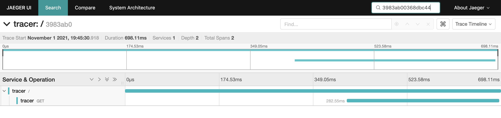
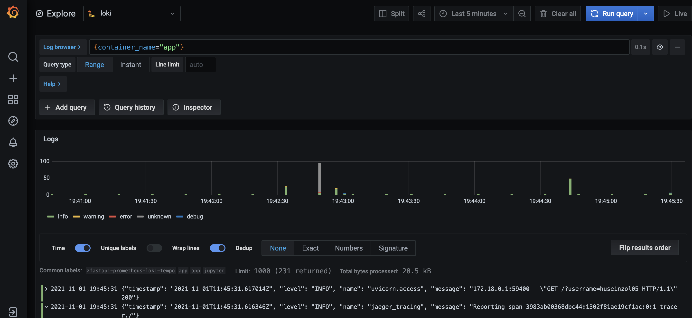
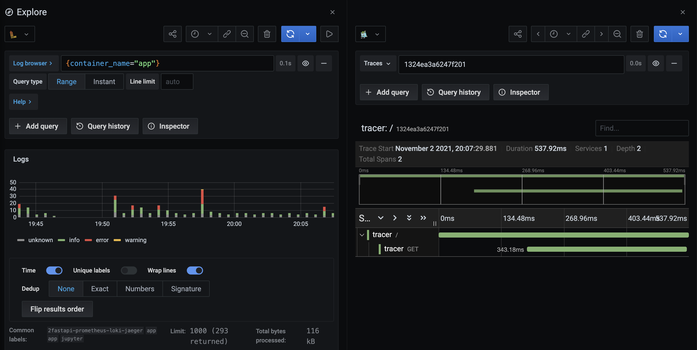

## How-to

Inspired from https://github.com/joe-elliott/tempo-otel-example, just the code to FastAPI python.

1. Install Loki Driver,

```bash
docker plugin install grafana/loki-docker-driver:latest --alias loki --grant-all-permissions
```

2. Run docker compose,

```bash
docker-compose up --build
```

## pictures





