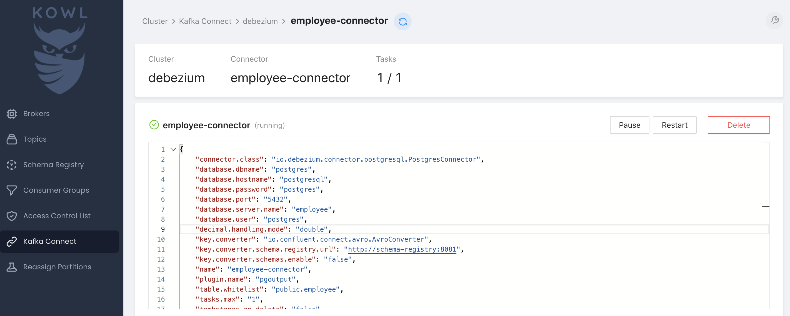
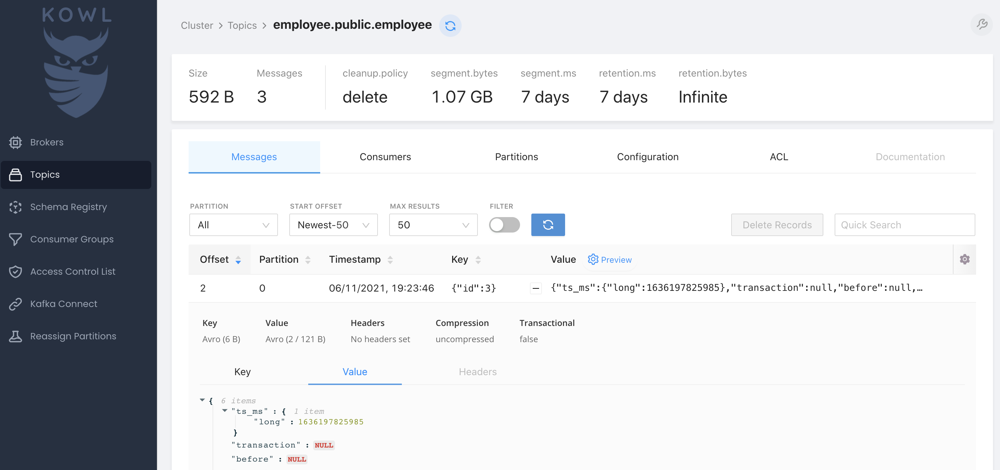

## How-to

1. Run Postgres,

```bash
docker-compose -f postgres.yaml up -d
```

2. Execute sql,

```bash
docker exec postgresql bash -c \
'PGPASSWORD=postgres psql -d postgres -U postgres -c "(cat /bitnami/postgresql/conf/table.sql)"'
```

Or to get into psql,

```bash
docker exec -it postgresql bash -c 'PGPASSWORD=postgres psql -d postgres -U postgres'
```

3. Run KsqlDB stack,

```bash
docker-compose down
docker-compose up
```

4. Add Postgres CDC,

```bash
curl --location --request POST http://localhost:8083/connectors/ \
--header 'Content-Type: application/json' \
--data-raw '{
  "name": "employee-connector",
  "config": {
    "connector.class": "io.debezium.connector.postgresql.PostgresConnector",
    "tasks.max": "1",
    "plugin.name": "pgoutput",
    "database.hostname": "postgresql",
    "database.port": "5432",
    "database.user": "postgres",
    "database.password": "postgres",
    "database.dbname" : "postgres",
    "database.server.name": "employee",
    "key.converter": "io.confluent.connect.avro.AvroConverter",
    "key.converter.schema.registry.url": "http://schema-registry:8081",
    "value.converter": "io.confluent.connect.avro.AvroConverter",
    "value.converter.schema.registry.url": "http://schema-registry:8081",
    "key.converter.schemas.enable":"false",
    "value.converter.schemas.enable": "false",
    "table.whitelist": "public.employee",
    "tombstones.on.delete": "false",
    "decimal.handling.mode": "double"
  }
}'
```



Anything happened, need to delete of refresh the config,

```bash
curl --location --request DELETE http://localhost:8083/connectors/employee-connector
```

To test the CDC, insert / update rows,

```bash
docker exec -it postgresql bash -c 'PGPASSWORD=postgres psql -d postgres -U postgres'
insert into employee values (3, 'siti', now());
```



5. Create a new stream in KsqlDB,

```bash
docker exec -it ksqldb-cli ksql http://ksqldb-server:8088
```

```sql
CREATE STREAM employee
  WITH (
    KAFKA_TOPIC='employee.public.employee',
    VALUE_FORMAT='AVRO'
  );
```

