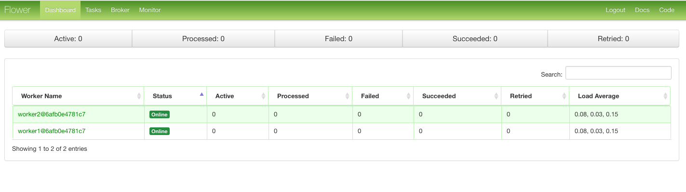
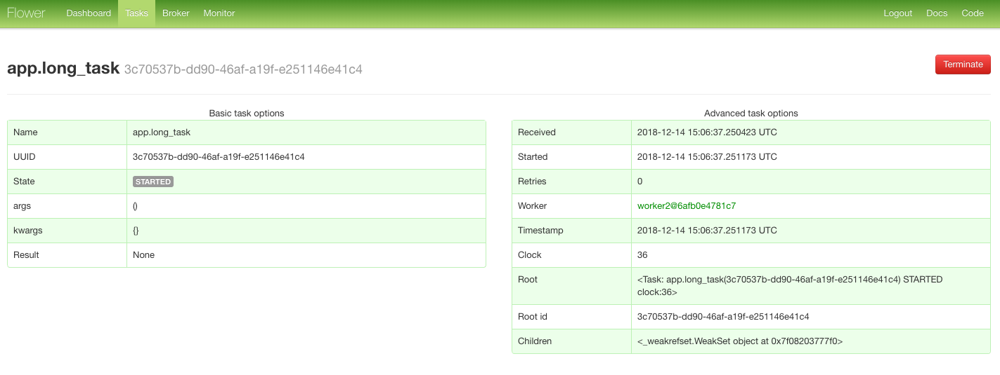
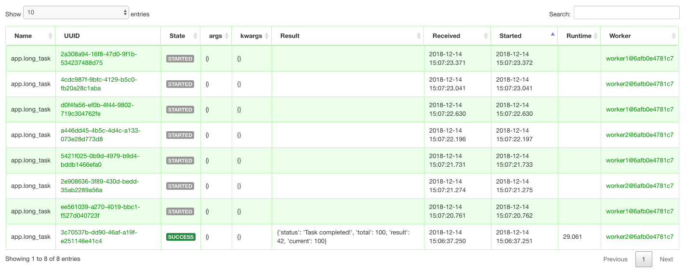
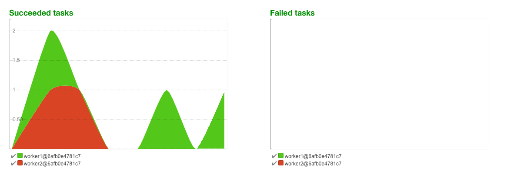

## How-to

1. Run [compose/build](compose/build),
```bash
compose/build
```

2. Request some long task,
```bash
curl localhost:5000/longtask
```

Example output,
```text
{
  "task_id": "659ee28d-2fab-4568-8c3b-1a760f4fd8c1"
}
```

3. Check task id returned,
```bash
curl localhost:5000/status/659ee28d-2fab-4568-8c3b-1a760f4fd8c1
```

Example output,
```text
{
  "current": 18,
  "state": "PROGRESS",
  "status": "Checking radiant orbiter...",
  "total": 34
}
```

## Printscreen, visit [localhost:5000](localhost:5000)

#### Front flower dashboard



#### Task description



#### List of tasks



#### Graphs execution


