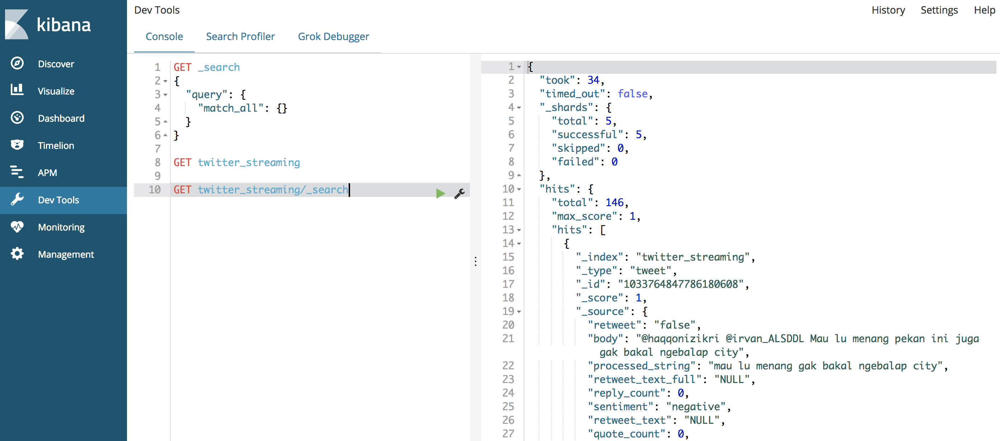

## How-to

1. Insert keys related,

Make sure you inserted related keys in twitter-streaming.py

```python
consumer_key=""
consumer_secret=""

access_token=""
access_token_secret=""
```

2. Run `Docker compose`,
```bash
compose/build
```


