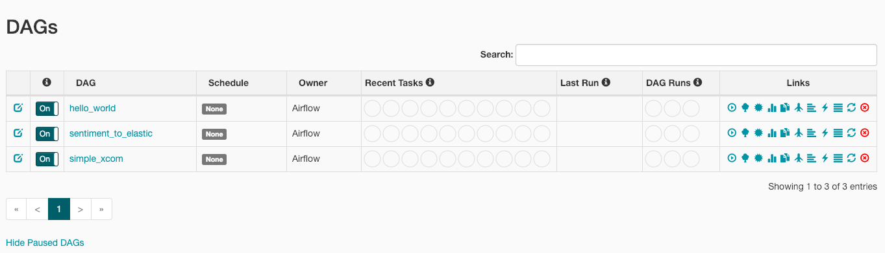
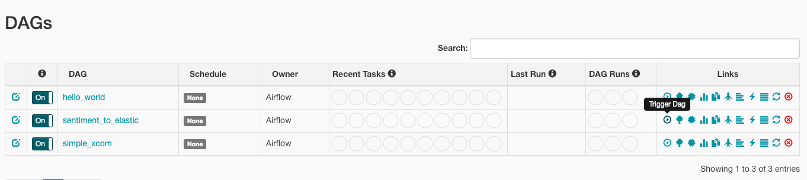
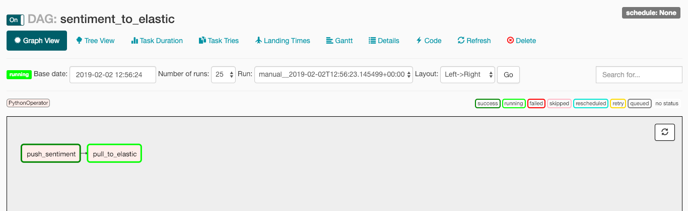
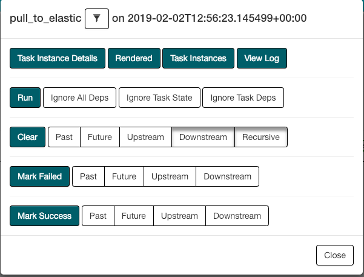

## How-to

1. Run `Docker compose`,
```bash
docker-compose -f docker-compose.yml up --build
```

2. Make sure our Flask is okay,
```bash
curl localhost:5000
```

```text
HOLLA!
```

Let's request our sentiment data,
```bash
curl localhost:5000/index/positive
```

```text
elasticsearch.exceptions.NotFoundError: NotFoundError(404, 'index_not_found_exception', 'no such index')
```

Ops, we forgot to run ETL, tensorflow -> elasticsearch

3. Go to [airflow dashboard](http://localhost:8080),



Trigger our ETL, `sentiment_to_elastic`,



4. Wait our ETL done,

Click on graph view,


You will go to graph mode,



Click any task and view the log,



Seems done for now,


5. Now request back our Flask,

```bash
curl localhost:5000/index/negative
```

```text
{
  "_shards": {
    "failed": 0,
    "skipped": 0,
    "successful": 5,
    "total": 5
  },
  "hits": {
    "hits": [
      {
        "_id": "4-text",
        "_index": "test_index",
        "_score": 0.0,
        "_source": {
          "sentiment_label": "negative",
          "text": "because the reddit liberal brigade would downvote it to oblivion within minutes does that sound about right"
        },
        "_type": "text"
      },
      {
        "_id": "8-text",
        "_index": "test_index",
        "_score": 0.0,
        "_source": {
          "sentiment_label": "negative",
          "text": "this really is pathetic you send shit to other countries and you have to include the obligatory proselytizing bullshit really gt i love jesus because"
        },
        "_type": "text"
      },
      {
        "_id": "16-text",
        "_index": "test_index",
        "_score": 0.0,
        "_source": {
          "sentiment_label": "negative",
          "text": "its too bad their lifespan is measured in days"
        },
        "_type": "text"
      },
      {
        "_id": "19-text",
        "_index": "test_index",
        "_score": 0.0,
        "_source": {
          "sentiment_label": "negative",
          "text": "that was todays talking point"
        },
        "_type": "text"
      },
      {
        "_id": "39-text",
        "_index": "test_index",
        "_score": 0.0,
        "_source": {
          "sentiment_label": "negative",
          "text": "wow thanks for all the context op"
        },
        "_type": "text"
      },
      {
        "_id": "42-text",
        "_index": "test_index",
        "_score": 0.0,
        "_source": {
          "sentiment_label": "negative",
          "text": "the point of the article is that while everyone outside of the fox bubble understands that it is an astroturf group funded by billionaires many progressives see teaparty supporters as uninformed low income fools who are working against their own best interest while the reality is that the majority of teaparty supporters are the same wealthy conservatives that have been around since the reagan revolution this is not to say that the media hasnt focused on the image of the ignorant whitetrash supporter with a severe spelling dysfunction"
        },
        "_type": "text"
      },
      {
        "_id": "43-text",
        "_index": "test_index",
        "_score": 0.0,
        "_source": {
          "sentiment_label": "negative",
          "text": "did he cut a large circular mouth hole"
        },
        "_type": "text"
      },
      {
        "_id": "48-text",
        "_index": "test_index",
        "_score": 0.0,
        "_source": {
          "sentiment_label": "negative",
          "text": "but you have to go to the hospital at some point in your life your use of the product is 100 guaranteed so you should have to pay for that product since its inevitable that youll use it we agree that theyre crooks but so many people thought a single payer system was bad so we kept the crooks alive democrats wanted single payer republicans wanted nothing the aca was the compromise"
        },
        "_type": "text"
      },
      {
        "_id": "56-text",
        "_index": "test_index",
        "_score": 0.0,
        "_source": {
          "sentiment_label": "negative",
          "text": "so this guy is dick right"
        },
        "_type": "text"
      },
      {
        "_id": "74-text",
        "_index": "test_index",
        "_score": 0.0,
        "_source": {
          "sentiment_label": "negative",
          "text": "another thing just to add when a white person says something conservative or profound its tossed to the side and called racist but if you put a black persons picture above it or say morgan freeman said it or whatever it blows up my news feed as the greatest thing ever said"
        },
        "_type": "text"
      }
    ],
    "max_score": 0.0,
    "total": 532
  },
  "timed_out": false,
  "took": 114
}
```
