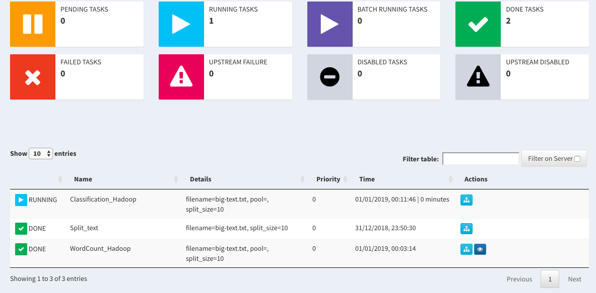

## How-to

1. Make sure you installed `Docker` and `Docker-compose`.

2. Spawn the container,
```bash
compose/build
```

3. Open new tab / window for terminal and access bash inside that container,
```bash
compose/bash
```

4. And you can start instructions below!

#### [Overview hadoop dashboard](http://localhost:9870)


You can check HDFS file system, Utilities -> Browse the file system


#### [Overview hadoop jobs](http://localhost:8088/cluster)


#### How to remove Yarn job

1. Get job id,
```text
2018-10-28 07:35:18,170 INFO impl.YarnClientImpl: Submitted application application_1540702588430_0006
2018-10-28 07:35:18,261 INFO mapreduce.Job: The url to track the job: http://6de2d313baf4:8088/proxy/application_1540702588430_0006/
2018-10-28 07:35:18,268 INFO mapreduce.Job: Running job: job_1540702588430_0006
```

2. kill the application,
```bash
yarn application -kill application_1540702588430_0006
```

#### HDFS basic command

Delete a HDFS directory,
```bash
hdfs dfs -rm -r /user/output_lower
```

Copy a HDFS directory to your local directory,
```bash
hadoop fs -get /user/output_lower
```

Copy a file to HDFS,
```bash
hadoop fs -put dictionary-test.json /user/dictionary-test.json
```

#### Distributing wordcount, [wordcount-hadoop.py](wordcount-hadoop.py)

1. Run luigi task, (yes, we cannot run hadoop task inside a notebook, tested before, also cannot use `luigi.build` inside the script)

```bash
luigi --module wordcount-hadoop WordCount_Hadoop --filename big-text.txt --split-size 10 --scheduler-host localhost --scheduler-port 8082
```

You can check running task on [Luigi Dashboard](http://localhost:8083),


```text
===== Luigi Execution Summary =====

Scheduled 2 tasks of which:
* 1 complete ones were encountered:
    - 1 Split_text(filename=big-text.txt, split_size=10)
* 1 ran successfully:
    - 1 WordCount_Hadoop(filename=big-text.txt, split_size=10)

This progress looks :) because there were no failed tasks or missing dependencies

===== Luigi Execution Summary =====
```

2. Copy from hdfs to local,

```bash
hadoop fs -get /user/input_text/wordcount .
```

#### Distributing text classification,

1. Run luigi task, (yes, we cannot run hadoop task inside a notebook, tested before, also cannot use `luigi.build` inside the script)

```bash
luigi --module textclassification-hadoop Classification_Hadoop --filename big-text.txt --split-size 10 --scheduler-host localhost --scheduler-port 8082
```

You can check running task on [Luigi Dashboard](http://localhost:8083),


```text
===== Luigi Execution Summary =====

Scheduled 2 tasks of which:
* 1 complete ones were encountered:
    - 1 Split_text(filename=big-text.txt, split_size=10)
* 1 ran successfully:
    - 1 Classification_Hadoop(filename=big-text.txt, split_size=10)

This progress looks :) because there were no failed tasks or missing dependencies

===== Luigi Execution Summary =====
```

2. Copy from hdfs to local,

```bash
hadoop fs -get /user/input_text/classification .
```
