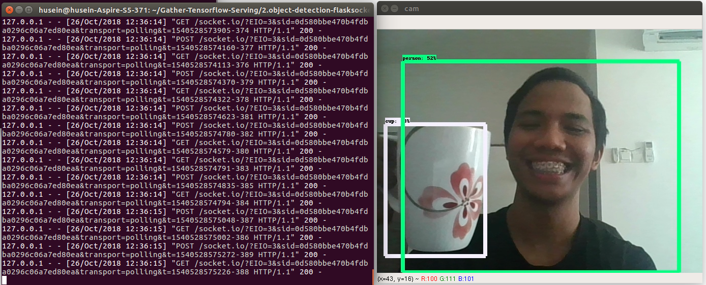

## How-To

This repository only support Tensorflow Zoo model, https://github.com/tensorflow/models/blob/master/research/object_detection/g3doc/tf1_detection_zoo.md.

if you want to use your own model, you need to change some code in [object_detection.py](object_detection.py).

1. Run the server,
```bash
python3 app.py
```

2. Run the client, make sure your edit [camera.py](camera.py) put server ip on any snippets related,

```bash
python3 camera.py
```


