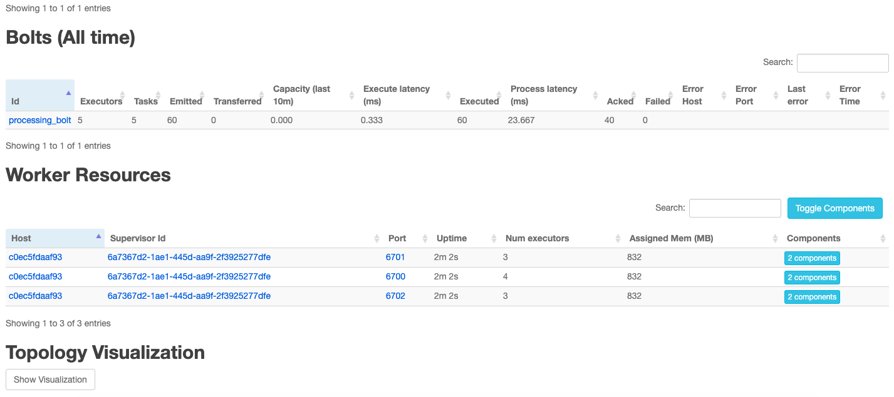

## How-to

1. Insert twitter keys in [docker-compose.yml](docker-compose.yml)

```text
environment:
  consumer_key: ''
  consumer_secret: ''
  access_token: ''
  access_token_secret: ''
```

2. Run `Docker compose`,

```bash
docker-compose -f docker-compose.yml up --build
```

If you saw,

```
tweepy-producer    | published on 2019-08-14T17:04:35
tweepy-producer    | published on 2019-08-14T17:04:36
tweepy-producer    | published on 2019-08-14T17:04:37
tweepy-producer    | published on 2019-08-14T17:04:38
tweepy-producer    | published on 2019-08-14T17:04:38
tweepy-producer    | published on 2019-08-14T17:04:40
tweepy-producer    | published on 2019-08-14T17:04:41
```

Everything is perfect.

3. Go to [apache storm dashboard](http://localhost:8085),



4. Request data in [kibana](http://localhost:5601),

```
GET twitter_test_v1/_search
```

```
{
  "took": 13,
  "timed_out": false,
  "_shards": {
    "total": 5,
    "successful": 5,
    "skipped": 0,
    "failed": 0
  },
  "hits": {
    "total": 103,
    "max_score": 1,
    "hits": [
      {
        "_index": "twitter_test_v1",
        "_type": "sentence",
        "_id": "a10e0f96-beb5-11e9-b1c2-0242ac12000b",
        "_score": 1,
        "_source": {
          "datetime": "2019-08-14T16:25:06",
          "text": "Well, this is really bad...",
          "label": "positive"
        }
      }
    }
}
```
