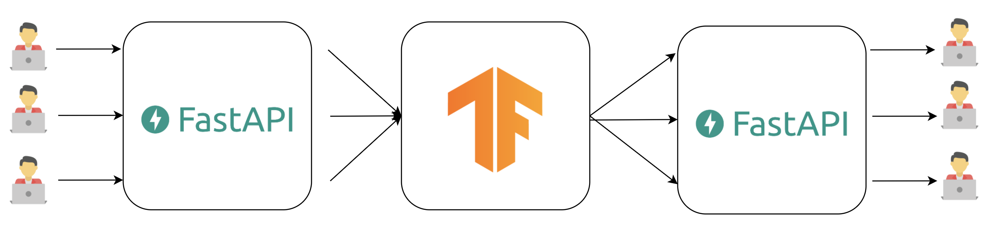
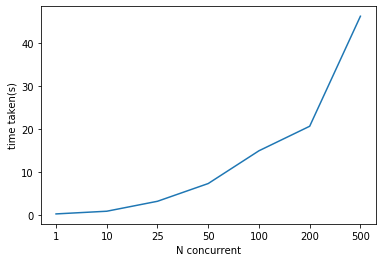
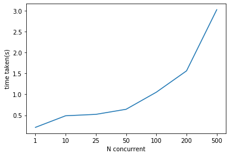

## Explanation

Most of machine learning models are vector based, so we can calculate N-size of batch in a single feed (single vector operation). Problem here, most of API design to accept an element from users, after that calculate one by one by doing 1-size batch vector operation.


When we have huge requests in a short time, 1-size batch vector operation become expensive due to big size of 1-size batch. So in here, we want to groupby multiple 1-size batch into N-size batch and do single vector operation and returned back to N users.

We can achieve this using [Streamz](https://streamz.readthedocs.io/en/latest/core.html) and [water-healer](https://github.com/huseinzol05/water-healer), can check [app/model.py](app/model.py).

Basically, **change concurrent requests into mini-batch realtime processing to speed up feed-forward**.



## How-to

1. Run docker compose,

```bash
docker-compose.yaml up --build
```

2. Check [example](example.ipynb) for more details.

If process single string one-by-one,

```python
%%time

requests.get(element_url + string).json()
```

Output,

```text
CPU times: user 5.86 ms, sys: 3.45 ms, total: 9.3 ms
Wall time: 128 ms
```

If process single string by batch,

```python
%%time

requests.get(batch_url + string).json()
```

Output,

```text
CPU times: user 3.62 ms, sys: 1.75 ms, total: 5.37 ms
Wall time: 285 ms
```

We might see batch is more expensive because overhead of batching processing.

But, if we send requests concurrently, let say N requests split microseconds, the speed become different.

If process single string one-by-one 50 concurrently,

```python
%%time

concurrent(element_url, n = 50)
```

Output,

```text
CPU times: user 120 ms, sys: 26.1 ms, total: 146 ms
Wall time: 5.07 s
```

If process single string by batch 50 concurrently,

```python
%%time

concurrent(batch_url, n = 50)
```

Output,

```text
CPU times: user 123 ms, sys: 25.1 ms, total: 148 ms
Wall time: 767 ms
```

batch only took 767 ms while one-by-one took 5.07 seconds.

## Stress-test

Requests,

```python
x = [1, 10, 25, 50, 100, 200, 500]
# 1 concurrent, 10 concurrent, and so on.
```

Normal concurrent ASGI,



Normal concurrent ASGI + Streamz + Waterhealer



**Again, make sure you scale to GPU / TPU if you have massive concurrent requests, CPU can be really slow on big vectors.**