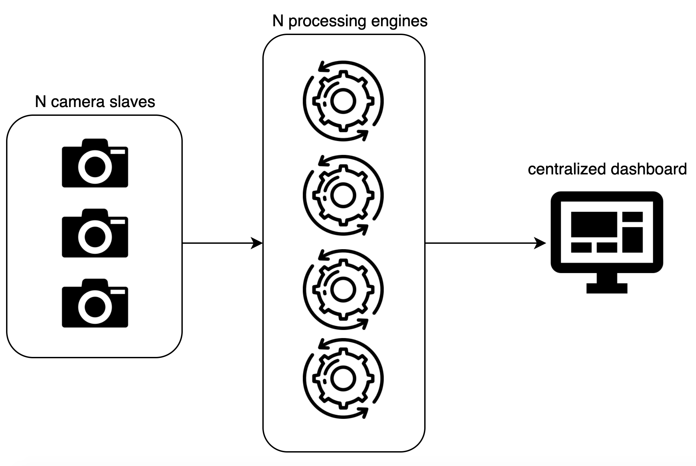

## Explanation

N slaves -> N processing engines -> single dashboard.



**Running in Kubernetes should be easier, deployment by default comes with load balancer, nginx is not required**.

## How-To

This repository only support Tensorflow Zoo model, https://github.com/tensorflow/models/blob/master/research/object_detection/g3doc/tf1_detection_zoo.md.

if you want to use your own model, you need to change some code in [object_detection.py](object_detection.py).

1. Run [display.py](display.py),

```bash
python3 display.py
```

2. Run docker-compose for N size processing,

```bash
docker-compose -f docker-compose.yaml up --build
```

3. Run [client.py](client.py),

```bash
python3 client.py
```
