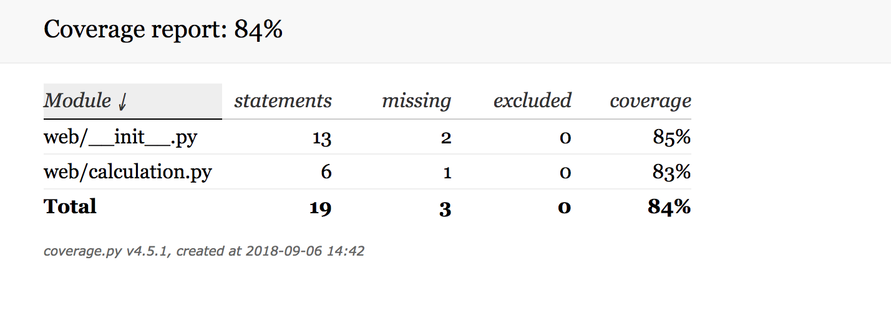

## How-to

1. Run `Docker compose`,
```bash
compose/build
```

```text
pytest_1  | Name                 Stmts   Miss  Cover
pytest_1  | ----------------------------------------
pytest_1  | web/__init__.py         13      2    85%
pytest_1  | web/calculation.py       6      1    83%
pytest_1  | ----------------------------------------
pytest_1  | TOTAL                   19      3    84%
pytest_1  | Coverage HTML written to dir htmlcov
```

2. Open report/index.html


